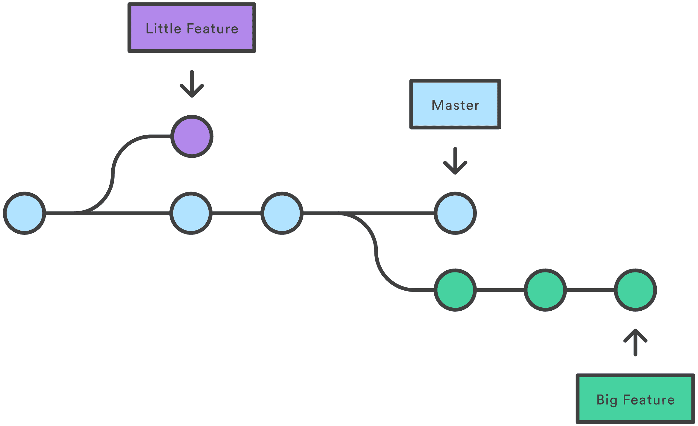

GitHub repository URL : 

# Git & Github 사용법

## 1. Github 사용을 위한 사전 지식  
### (1) 커밋(commit)과 푸시(push)
- 커밋 (commit) : 파일을 추가하거나 변경 내용을 저장소에 저장하는 작업
- 푸시 (push) : 파일을 추가하거나 변경 내용을 원격 저장소에 업로드하는 작업  

### (2) 로컬 저장소와 원격 저장소
- 로컬 저장소 : 자신의 컴퓨터에 있는 파일이나 디렉토리를 저장하는 장소
- 원격 저장소 : 서버등 네트워크에 있는 파일이나 디렉토리를 저장하는 장소, 기본적으로 로컬 저장소에서 작업을 수행하고 그 결과를 원격 저장소에 저장함, 다른 사람들과 공유 가능

### (3) 브랜치 (branch)
- 소프트웨어의 여러 버전 관리 기능
- 하나의 프로젝트를 여러 갈래로 나누어 관리 가능함
- 일종의 독립된 작업을 진행하기 위한 작업 공간  

### (4) Git의 3가지 상태
- Committed : 로컬 저장소에 데이터가 안전하게 저장됨
- Modified : 아직 로컬 저장소에 수정한 파일을 커밋하지 않음
- Staged : 현재 수정한 파일을 곧 커밋할 것임을 의미함

## 2. Github 사용법  
