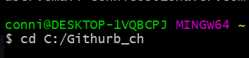
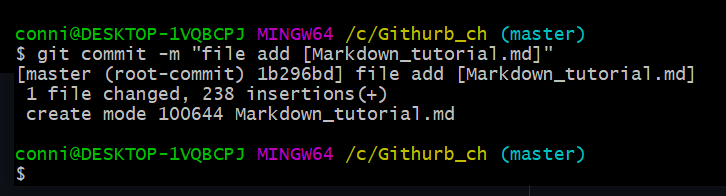

GitHub repository URL : 

# Git & Github 사용법

## 1. Github 사용을 위한 사전 지식  
### (1) 커밋(commit)과 푸시(push)
- 커밋 (commit) : 파일을 추가하거나 변경 내용을 저장소에 저장하는 작업
- 푸시 (push) : 파일을 추가하거나 변경 내용을 원격 저장소에 업로드하는 작업  

### (2) 로컬 저장소와 원격 저장소
- 로컬 저장소 : 자신의 컴퓨터에 있는 파일이나 디렉토리를 저장하는 장소
- 원격 저장소 : 서버등 네트워크에 있는 파일이나 디렉토리를 저장하는 장소, 기본적으로 로컬 저장소에서 작업을 수행하고 그 결과를 원격 저장소에 저장함, 다른 사람들과 공유 가능

### (3) 브랜치 (branch)
- 소프트웨어의 여러 버전 관리 기능
- 하나의 프로젝트를 여러 갈래로 나누어 관리 가능함
- 일종의 독립된 작업을 진행하기 위한 작업 공간  

### (4) Git의 3가지 상태
- Committed : 로컬 저장소에 데이터가 안전하게 저장됨
- Modified : 아직 로컬 저장소에 수정한 파일을 커밋하지 않음
- Staged : 현재 수정한 파일을 곧 커밋할 것임을 의미함

## 2. Github 사용법  
### (1) Git 다운로드  
- Git SCM 접속 후 운영체제에 맞는 설치 파일 다운로드
- Git SCM URL : https://git-scm.com/  

### (2) Git Bash에서 깃 버전 확인
    git --version

### (3) Git 사용자 등록 및 확인
- Git 설치 후, 사용 환경 설정 필요
- git config 명령어로 이름, 이메일 설정하고 변경 가능  

      git config --global user.name "name"
      git config --global user.email "email address"

- 프로젝트 마다 다른 설정 원한다면, --global 빼기  

      git config --list

- 사용자 확인 가능

## 3. Git 저장소 생성
- 첫번 째 방법 : 버전 관리를 하지 않는 로컬 저장소를 Git 저장소로 활용
- 두번 째 방법 : 다른 곳에서 Git 저장소를 Clone하여 활용  

### (1-1) 로컬 저장소로 활용할 폴더 생성

- GitHub_ch 폴더 생성

### (1-2) 해당 폴더로 위치 이동
- cd 명령어 사용  

      cd [로컬 저장소 경로]

- 마우스 우클릭으로 Git Bash Here 실행

### (1-3) Git 원격 저장소 생성
- 버전 관리를 하지 않는 기존 프로젝트를 Git으로 관리하기 위해 위의 과정을 거쳐 프로젝트의 디렉토리로 이동한 상태
- git init 명령어 실행
- 버전 관리를 하고 싶은 폴더에서 초기화 상태로 만드는 준비를 하는 명령어
- 현재 디렉토리 기준 .git이라는 하위 디렉토리 Git 저장소 생성  

      git init

------------
### (2-1) 복제할 원격 저장소 clone 주소 복사
### (2-2) git clone 명령어 사용
- (1) 번은 버전관리를 하지 않는 기존 프로젝트를 Git으로 관리하는 방법, 이 방법은 기존 저장소를 복사하는 방법
- 다른 프로젝트에 참여 혹은 Git 저장소를 복사할 때 사용
- 로컬 저장소, Github에 있던 원격 저장소를 복사 가능  

      git clone [URL]

## 4. Git 명령어
### (1) 원격 저장소 조작
    git remote add [remote repository의 이름] [원격 저장소 github URL]

    git remote

- 추가한 원격 저장소의 이름 목록 확인

### (2) 파일 추가하기

- 로컬 저장소에 문서 생성 후 git add를 사용하여 파일 추척 가능

      git add [파일 이름]

      git add .
- . 을 넣으면 모든 파일 한번에 추적 가능

### (3) 파일 상태 확인하기
- git status 는 현재 나의 로컬 폴더와 Git과의 상태를 체크해 줌  
      
      git status

### (4) 변경사항 확정 하기
- git commit은 추가 된 파일이나 폴더의 내용을 저장소로 보낼 때 사용
- 변경사항을 확정 함  
     
      git commit -m "커밋 메세지"

        
      git commit -a
- -a라는 커밋 메세지 옵션은 별도의 add 명령어를 사용하지 않고 수정된 파일에 add와 commit을 한번에 수행함

      git commit -am
- a와 m을 합친 기능을 함

### (5) 커밋 히스토리 조회하기
- git log로 로컬 저장소의 커밋 히스토리 조회가능  

      git log

### (6) 로컬 저장소에서 원격 저장소로 이동
- 내 로컬 저장소에서 커밋한 파일들은 원격 저장소에서 다룰 수 없음
- git push 를 이용하여 로컬 저장소에 커밋한 파일들을 원격 저장소에 추가  

      git push [원격 저장소 이름] [브랜치 명]

- push 하고 나면 github 에서 커밋 내용 확인가능

### (7) 브랜치(branch) 사용
- 하나의 프로젝트를 여러 갈래로 나누어 관리하고 싶기에 사용
- 원래 버전과 비교하여 또 하나의 새로운 버전을 만들어 냄

#### (7-1) branch 목록 보기
      
      git branch

- master 브랜치 존재
- * 표시는 활성화된 브랜치라는 의미

#### (7-2) branch 생성 하기

      git branch [브랜치명]

- vi는 생성한 FirstBranch 에서 문서를 편집하기 위한 명령

- 명령 모드(command mode) : 처음 vi 명령어로 vi를 시작, 여기서는 방향키를 이용하여 커서를 이동할 수 있으며,  "dd" 나 "yy" 로 한 줄 삭제 및 한 줄 붙여넣기, 또는 "x" 명령어로 글자 하나를 삭제할 수 있음

- 입력 모드(insert mode) : 명령모드에서 "i" 나 "a" 명령을 통해서 입력 모드로 넘어 갈 수있음, 입력모드로 가게되면 자유롭게 코드나 글을 작성, 명령 모드로 다시 돌아오려면 "ESC"를 누르기 ("i" 명령은 커서가 현재 위치한 부분에서 부터, "a"는 커서 바로 다음 부분부터)

- 마지막 행 모드(Last line mode) : 마지막행 모드는 명령모드에서 ":" (콜론) 을 입력하면 화면 맨 밑단에 :______ 하며 입력을 할수 있는 공간이 나옴, 여기서 현재까지 내가 작성한 이 내용을 저장하고 vi를 종료(wq)할지, 그냥 종료(q, q!)할지 등을 입력할 수 있음

- status를 통해 상태 확인

- push 명령으로 원격 저장소로 전송

- 원격 저장소에서 확인 가능

#### (7-4) 브랜치 이동 하기
      
      git checkout [브랜치명]
      

- 독립된 작업 공간인 브랜치를 자유롭게 이용하기 위해 사용
- master에서 FirstBranch로 브랜치를 이동함

#### (7-4) 브랜치 병합하기
- 한 프로젝트를 여러 명에서 협업을 할 때 사용
- 각자의 브랜치에서 작업을 한 것을 하나의 브랜치로 병합하기
- 브랜치 병합 방법에는 두가지 방법 존재

- 첫번 째 방법 : merge 이용  
 
      git merge [브랜치명]
      
- 두번 째 방법 : rebase 이용

      git rebase [브랜치명]
      
### (8) 원격 저장소에서 로컬 저장소로 보내기
- 다른 사람이 업데이트 한 파일이 원격 저장소에 있다면, 내가 가장 최신 상태로 작업하기 위해서 pull 명령어 사용
- 명령어를 통해 원격 저장소와 내 로컬 저장소의 상태를 동일하게 만들어줌

      git pull [원격 저장소 이름] [브랜치명]

- 원격 저장소의 변경 내용이 로컬 작업 디렉토리에 받아지며 병합됨

### (9) 과거의 커밋으로 돌아가기
- 커밋을 잘못했다면 이전의 상태로 돌아가는 git reset 명령어를 이용

      git reset [옵션] [커밋ID]
 
|옵션|staging area|working directory|
|:---|---:|:---:|
|--mixed|초기화|변경 x|
|--hard|초기화|초기화|
|--soft|변경 x|변경 x|

### (10) 태그(tag) 남기기
- 태그는 커밋을 참조하기 쉽도록 알기 쉬운 이름을 붙여주는 도움을 주는 명령어
- 한번 붙인 태그는 위치 이동없이 고정됨

      git tag [태그 이름] [커밋 ID]
      git tag
      

## 5. 명령어 목록
|명령어|사용여부|링크|
|:---|---:|:---:|
|add|O|https://github.com/chaaehyun/GitHubPratice/blob/main/README.md#2-%ED%8C%8C%EC%9D%BC-%EC%B6%94%EA%B0%80%ED%95%98%EA%B8%B0|
|branch|O|초기화|
|checkout|O|변경 x|
|clone|O|https://github.com/chaaehyun/GitHubPratice/blob/main/README.md#2-2-git-clone-%EB%AA%85%EB%A0%B9%EC%96%B4-%EC%82%AC%EC%9A%A9|
|commit|O|https://github.com/chaaehyun/GitHubPratice/blob/main/README.md#4-%EB%B3%80%EA%B2%BD%EC%82%AC%ED%95%AD-%ED%99%95%EC%A0%95-%ED%95%98%EA%B8%B0|
|config|O|https://github.com/chaaehyun/GitHubPratice/blob/main/README.md#3-git-%EC%82%AC%EC%9A%A9%EC%9E%90-%EB%93%B1%EB%A1%9D-%EB%B0%8F-%ED%99%95%EC%9D%B8|
|init|O|https://github.com/chaaehyun/GitHubPratice/blob/main/README.md#1-3-git-%EC%9B%90%EA%B2%A9-%EC%A0%80%EC%9E%A5%EC%86%8C-%EC%83%9D%EC%84%B1|
|log|O|변경 x|
|merge|O|working directory|
|pull|O|:---:|
|push|O|변경 x|
|rebase|x|초기화|
|remote|O|https://github.com/chaaehyun/GitHubPratice/blob/main/README.md#1-%EC%9B%90%EA%B2%A9-%EC%A0%80%EC%9E%A5%EC%86%8C-%EC%A1%B0%EC%9E%91|
|reset --hard|x|변경 x|
|status|O|https://github.com/chaaehyun/GitHubPratice/blob/main/README.md#3-%ED%8C%8C%EC%9D%BC-%EC%83%81%ED%83%9C-%ED%99%95%EC%9D%B8%ED%95%98%EA%B8%B0|
|tag|O|변경 x|
